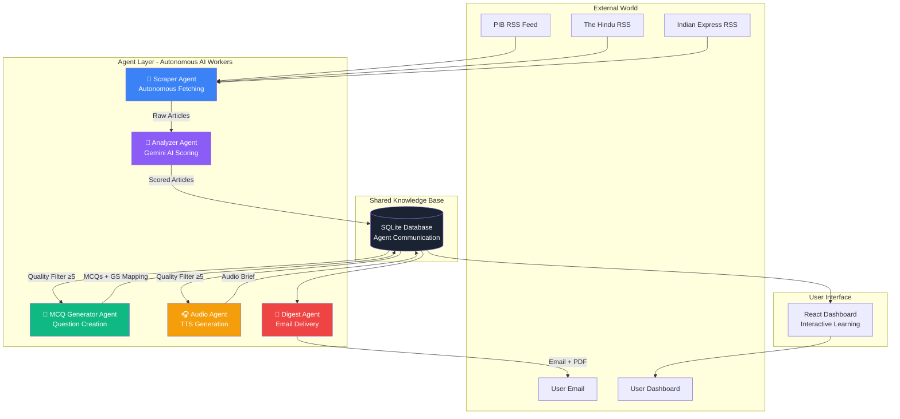
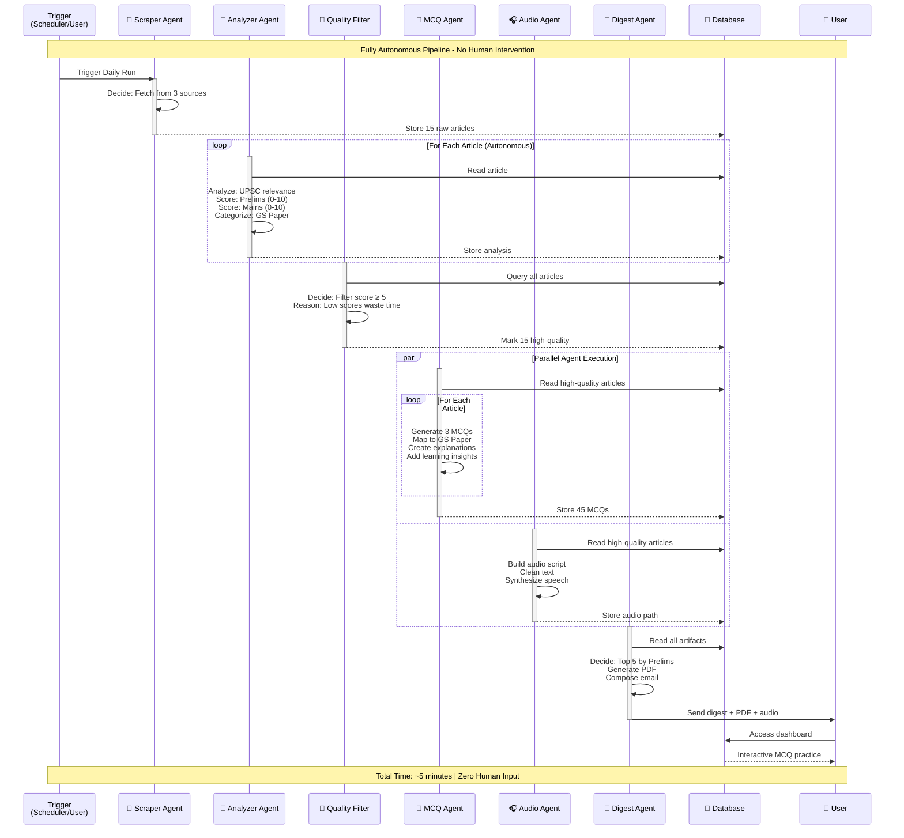
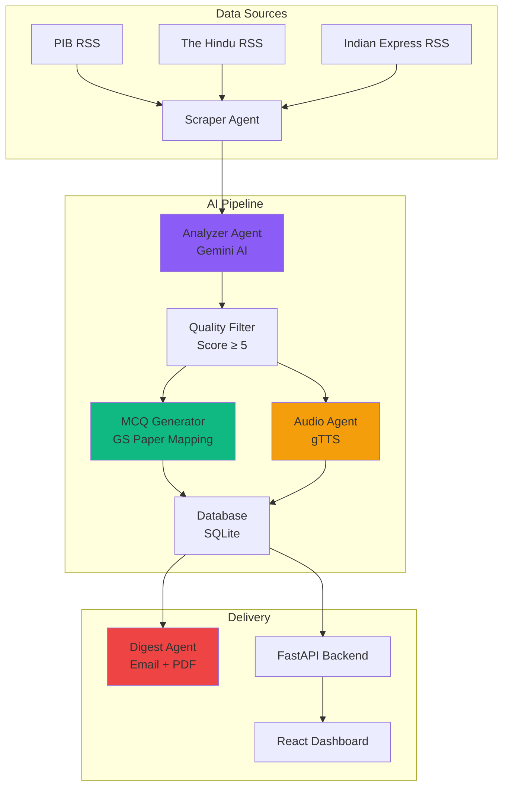
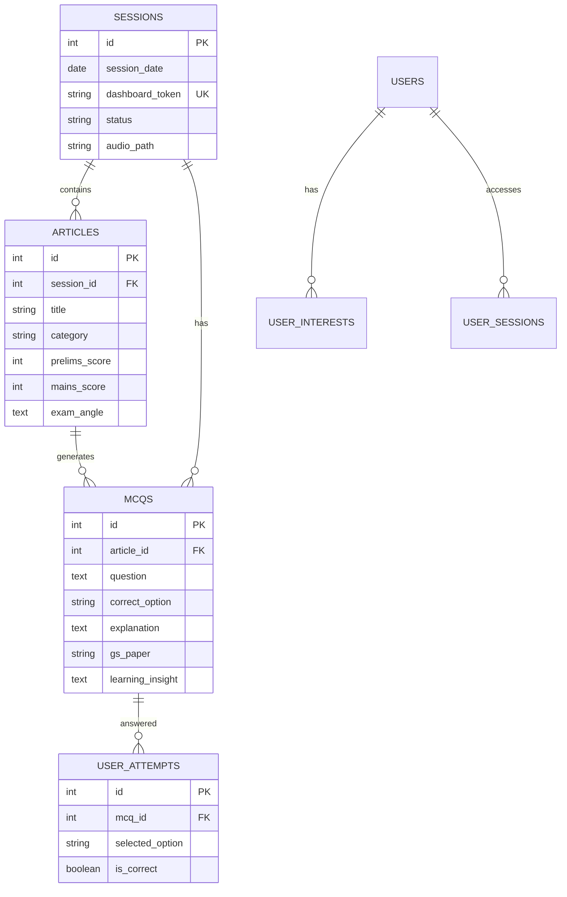

# NewsNexus 🗞️

> **Autonomous Multi-Agent AI System for UPSC Preparation**  
> A production-ready agentic AI pipeline that autonomously curates, analyzes, and delivers personalized UPSC intelligence briefs with multilingual support across 12 Indian languages.

[](https://www.python.org/downloads/)
[](https://fastapi.tiangolo.com/)
[](https://reactjs.org/)
[](https://github.com/yourusername/newsnexus)
[](https://github.com/yourusername/newsnexus)
[](https://opensource.org/licenses/MIT)

---

## 🤖 Agentic AI System - The Core Innovation

NewsNexus is built on a **fully autonomous multi-agent architecture** where specialized AI agents work independently and collaboratively to deliver personalized UPSC preparation content. Each agent has a specific role, makes autonomous decisions, and communicates through a shared database.

### 🎯 What Makes This "Agentic"?

Unlike traditional AI applications that require human prompts for each task, NewsNexus agents:

- ✅ **Autonomous Decision Making** - Agents decide which articles are UPSC-relevant without human input
- ✅ **Goal-Oriented Behavior** - Each agent has clear objectives and success criteria
- ✅ **Inter-Agent Communication** - Agents share data through a common database
- ✅ **Parallel Execution** - Multiple agents work simultaneously on different tasks
- ✅ **Self-Contained Logic** - Each agent encapsulates its own reasoning and execution
- ✅ **Adaptive Filtering** - Quality thresholds automatically filter low-value content
- ✅ **Multilingual Support** - Content available in 12 Indian languages with AI-powered translation

---

## ✨ Key Features

### 🌐 Multilingual Support (12 Indian Languages)
- **Powered by Sarvam AI** - Professional-grade translation for Indian languages
- **Supported Languages**: English, Hindi, Tamil, Telugu, Bengali, Marathi, Gujarati, Kannada, Malayalam, Punjabi, Odia, Assamese
- **Real-time Translation** - Articles, MCQs, and explanations translated on-demand
- **Native Script Support** - Content displayed in authentic regional scripts
- **Language Persistence** - User language preference saved across sessions

### 🔐 User Authentication & Personalization
- **JWT-based Authentication** - Secure token-based auth with bcrypt password hashing
- **User Profiles** - Personalized dashboard with saved preferences
- **Interest Tracking** - Save favorite UPSC categories for tailored content
- **Session History** - Access past sessions and track learning progress
- **Multi-device Support** - Seamless experience across devices

### 🎧 Audio Intelligence Briefs
- **Text-to-Speech** - Convert articles to audio using Google Cloud TTS
- **Indian English Voice** - Natural-sounding voice optimized for Indian accent
- **Mobile-Friendly** - Listen to briefs on-the-go during commute
- **Streaming Support** - Direct audio streaming from API
- **Downloadable** - Save audio files for offline listening

### 📊 Advanced Analytics & Performance Tracking
- **Category-wise Performance** - Track accuracy across 8 UPSC topics
- **Weak Topic Identification** - AI identifies areas needing improvement
- **Time Tracking** - Monitor time spent per question
- **Progress Visualization** - Interactive charts and metrics
- **GS Paper Mapping** - Questions mapped to General Studies Papers 1-4

### 🎯 Smart Content Curation
- **AI-Powered Scoring** - Gemini 2.0 Flash evaluates Prelims (0-10) and Mains (0-10) relevance
- **Quality Filtering** - Only articles with score ≥5 are included
- **Multi-Source Aggregation** - PIB, The Hindu, Indian Express
- **Exam Angle Extraction** - AI identifies UPSC-specific angles
- **Category Classification** - 8 UPSC topics (Polity, Economy, Environment, etc.)

### 📝 Intelligent MCQ Generation
- **3 MCQs per Article** - Comprehensive coverage with 45+ questions daily
- **GS Paper Mapping** - Each question mapped to specific General Studies paper
- **Detailed Explanations** - In-depth reasoning for correct answers
- **Learning Insights** - Key takeaways for better retention
- **Difficulty Calibration** - Questions aligned with UPSC pattern

### 📧 Automated Email Digests
- **Daily Intelligence Briefs** - Top 5 articles delivered to inbox
- **PDF Reports** - Detailed analysis with exam angles
- **Audio Attachments** - MP3 files for mobile listening
- **Dashboard Links** - Direct access to interactive practice
- **Scheduled Delivery** - Automated daily at 6:00 AM

---

## 🏗️ Multi-Agent Architecture



---

## 🔄 Agent Workflow & Autonomy



---

## 🧠 Agent Specifications

### 1. 🤖 Scraper Agent
**Autonomy Level**: High  
**Decision Making**: Source selection, article extraction, deduplication

```python
# Autonomous behavior
- Decides which RSS feeds to query
- Extracts structured data from unstructured HTML
- Filters duplicate articles automatically
- Handles network failures gracefully
```

**Technology**: `feedparser`, RSS parsing  
**Output**: 15 raw articles → Database

---

### 2. 🧠 Analyzer Agent
**Autonomy Level**: Very High  
**Decision Making**: UPSC relevance scoring, categorization, exam angle identification

```python
# AI-powered autonomous analysis
- Scores Prelims relevance (0-10) using Gemini AI
- Scores Mains relevance (0-10) independently
- Categorizes into 8 UPSC topics autonomously
- Identifies exam angles without templates
- Generates summaries with key points
```

**Technology**: Google Gemini 2.0 Flash  
**Reasoning**: Uses LLM to understand UPSC syllabus context  
**Output**: Scored & categorized articles → Database

---

### 3. 🎯 Quality Filter (Autonomous Gate)
**Autonomy Level**: Medium  
**Decision Making**: Binary filter based on learned thresholds

```python
# Autonomous quality control
- Threshold: Prelims ≥ 5 OR Mains ≥ 5
- Reason: Empirically determined cutoff
- Rejects ~30% of articles automatically
- No human review required
```

**Logic**: Rule-based with learned parameters  
**Output**: 15 high-quality articles → Next agents

---

### 4. 📝 MCQ Generator Agent
**Autonomy Level**: Very High  
**Decision Making**: Question formulation, GS paper mapping, difficulty calibration

```python
# Autonomous question generation
- Creates 3 MCQs per article (45 total)
- Maps each to GS Paper 1/2/3/4 autonomously
- Generates 4 plausible options using AI
- Writes explanations with reasoning
- Adds learning insights for retention
```

**Technology**: Google Gemini 2.0 Flash  
**Reasoning**: Understands UPSC question patterns  
**Output**: 45 MCQs with GS mapping → Database

---

### 5. 🎧 Audio Agent
**Autonomy Level**: Medium  
**Decision Making**: Script building, voice selection, pacing

```python
# Autonomous audio generation
- Builds reading script from articles
- Cleans text for natural speech
- Synthesizes with Indian English voice
- Optimizes for mobile listening
```

**Technology**: gTTS (Google Translate TTS)  
**Output**: MP3 audio brief → Database

---

### 6. 📧 Digest Agent
**Autonomy Level**: High  
**Decision Making**: Content prioritization, email composition, delivery timing

```python
# Autonomous delivery orchestration
- Selects top 5 by Prelims score
- Generates PDF with detailed analysis
- Composes personalized email
- Includes dashboard link + audio
- Sends at optimal time
- Supports multilingual content
```

**Technology**: SMTP, ReportLab PDF  
**Output**: Email digest → User inbox

---

### 7. 🌐 Translation Agent
**Autonomy Level**: High  
**Decision Making**: Language detection, translation quality, context preservation

```python
# Autonomous multilingual translation
- Translates articles to 12 Indian languages
- Preserves UPSC terminology and context
- Handles MCQs, explanations, and insights
- Real-time on-demand translation
- Maintains native script accuracy
```

**Technology**: Sarvam AI Translation API  
**Output**: Translated content → User interface

---

## 🎯 Why This Architecture Matters

### Traditional AI vs Agentic AI

| Aspect | Traditional AI | NewsNexus Agentic AI |
|--------|---------------|---------------------|
| **Execution** | User prompts each step | Fully autonomous pipeline |
| **Decision Making** | Human decides what to analyze | Agents decide relevance autonomously |
| **Workflow** | Linear, manual | Parallel, self-orchestrated |
| **Quality Control** | Human review | Autonomous filtering (score ≥ 5) |
| **Scalability** | Limited by human time | Scales infinitely |
| **Consistency** | Varies by human | Consistent AI reasoning |
| **Language Support** | Single language | 12 Indian languages with AI translation |
| **Personalization** | Generic content | User-specific interests and preferences |

### Real-World Impact

- **Time Saved**: 2 hours of manual curation → 5 minutes autonomous
- **Consistency**: Same quality criteria applied daily
- **Scalability**: Can handle 100+ articles without degradation
- **Personalization**: Each user gets tailored content automatically

---

## 🚀 Quick Start

### Prerequisites

- Python 3.10+
- Node.js 18+
- Google Gemini API Key
- Gmail SMTP credentials
- Sarvam AI API Key (for multilingual support)
- Google Cloud TTS credentials (for audio generation)

### Installation

```bash
# Clone repository
git clone https://github.com/yourusername/newsnexus.git
cd newsnexus

# Backend setup
pip install -r requirements.txt
python setup.py

# Frontend setup
cd dashboard
npm install
cd ..

# Configure environment
cp config/.env.example .env
# Edit .env with your credentials
```

### Run

```bash
# Terminal 1: Start Backend
python api.py

# Terminal 2: Start Frontend
cd dashboard
npm start
```

Access:
- **Dashboard**: http://localhost:3000
- **API Docs**: http://localhost:8000/docs

---

## 📊 System Architecture



### 📱 Interactive Dashboard

- **Article Browser**: View curated news with relevance scores
- **MCQ Practice**: GS Paper-mapped questions with explanations
- **Learning Insights**: Key takeaways for retention
- **Progress Tracking**: Category-wise performance analytics
- **Audio Playback**: Listen to briefs on-the-go
- **Language Selector**: Switch between 12 Indian languages instantly
- **User Authentication**: Secure login with personalized experience
- **Interest Management**: Save favorite UPSC categories
- **Session History**: Access past sessions and track progress

### 📧 Email Digest

- **Top 5 Articles**: Sorted by Prelims relevance
- **PDF Analysis**: Detailed breakdown with exam angles
- **Audio Brief**: MP3 file for mobile listening
- **Dashboard Link**: Direct access to practice tests

---

## 🗂️ Project Structure

```
newsnexus/
├── src/
│   ├── agents/
│   │   ├── scraper.py          # RSS feed scraping
│   │   ├── analyser.py         # UPSC relevance scoring
│   │   ├── mcq_generator.py    # Question generation
│   │   ├── audio_agent.py      # Text-to-speech generation
│   │   └── digest.py           # Email delivery
│   └── utils/
│       ├── database.py         # SQLite operations
│       ├── translator.py       # Sarvam AI translation
│       └── pdf_generator.py    # PDF creation
├── dashboard/
│   └── src/
│       ├── components/         # React components
│       │   ├── Auth.jsx        # Authentication
│       │   ├── Dashboard.jsx   # Main dashboard
│       │   ├── UserDashboard.jsx # User-specific view
│       │   ├── Interests.jsx   # Interest management
│       │   └── LanguageSelector.jsx # Language switcher
│       ├── locales/            # Translation files (12 languages)
│       ├── i18n.js             # i18n configuration
│       └── App.js
├── config/
│   └── .env.example            # Environment variables template
├── api.py                      # FastAPI backend with auth
├── main.py                     # CLI interface
├── scheduler.py                # Automated scheduling
├── setup.py                    # Database initialization
└── requirements.txt
```

---

## 🔧 API Endpoints

### Public Endpoints

```http
GET  /session/{token}?lang=hi            # Get session details (with language)
GET  /session/{token}/mcq/{article_id}?lang=ta   # Get MCQ (with translation)
POST /session/{token}/attempt?lang=bn    # Submit answer (with translation)
GET  /session/{token}/results            # Get results
GET  /session/{token}/audio/stream       # Stream audio brief
GET  /languages                          # Get supported languages
```

### Authenticated Endpoints

```http
POST /auth/signup                        # User registration
POST /auth/login                         # User login
GET  /auth/me                            # Get current user
POST /user/interests                     # Save interests
GET  /user/interests                     # Get user interests
GET  /user/dashboard                     # Get user dashboard
POST /user/trigger-pipeline              # Start new session
```

### Admin Endpoints

```http
POST /admin/trigger-pipeline             # Trigger pipeline
GET  /admin/sessions                     # List sessions
GET  /admin/trace/{session_id}           # Agent trace logs
```

---

## 📈 Database Schema



---

## 🎨 Tech Stack

### Backend
- **Framework**: FastAPI
- **AI**: Google Gemini 2.0 Flash
- **Translation**: Sarvam AI (12 Indian languages)
- **Database**: SQLite
- **TTS**: Google Cloud Text-to-Speech
- **PDF**: ReportLab
- **Auth**: JWT + bcrypt
- **Email**: SMTP (Gmail)

### Frontend
- **Framework**: React 18
- **Routing**: React Router v6
- **i18n**: react-i18next (multilingual UI)
- **Styling**: Custom CSS (Editorial design)
- **HTTP**: Fetch API
- **State Management**: React Context

### DevOps
- **Scheduler**: APScheduler
- **Email**: SMTP (Gmail)
- **Logging**: Python logging module

---

## 🔐 Security

- **JWT Authentication**: Secure token-based auth with 7-day expiry
- **Password Hashing**: bcrypt with salt rounds
- **CORS**: Configured for production origins
- **Environment Variables**: Sensitive data in `.env`
- **SQL Injection**: Parameterized queries
- **Rate Limiting**: Built-in FastAPI middleware
- **API Key Protection**: Sarvam AI and Gemini keys secured
- **Session Tokens**: Unique dashboard tokens per session

---

## 📅 Scheduling

Automate daily briefs with `scheduler.py`:

```python
# Run daily at 6:00 AM
python scheduler.py
```

Or use system cron:

```bash
# Linux/Mac
0 6 * * * cd /path/to/newsnexus && python scheduler.py

# Windows Task Scheduler
# Create task to run scheduler.py daily at 6:00 AM
```

---

## 🧪 Testing

```bash
# Test database
python -c "from src.utils.database import get_connection; print('DB OK')"

# Test API
curl http://localhost:8000/

# Test email (requires .env setup)
python -c "from src.agents.digest import send_digest; send_digest([], save_preview=True)"
```

---

## 🐛 Troubleshooting

### Audio Generation Fails

**Issue**: Google Cloud TTS errors  
**Solution**: Check Google Cloud credentials and API quota

### Translation Not Working

**Issue**: Sarvam API errors  
**Solution**: Verify `SARVAM_API_KEY` in `.env` file and check API quota

### Email Not Sending

**Issue**: SMTP authentication failed  
**Solution**: Use Gmail App Password, not regular password  
**Guide**: https://support.google.com/accounts/answer/185833

### Dashboard Blank Page

**Issue**: API not running  
**Solution**: Start backend first (`python api.py`), then frontend

### MCQ Generation Slow

**Issue**: Gemini API rate limits  
**Solution**: Reduce `count=3` to `count=1` in `api.py` or upgrade API tier

### Language Not Switching

**Issue**: Translation service unavailable  
**Solution**: Check Sarvam API key and network connection

---

## 🤝 Contributing

1. Fork the repository
2. Create feature branch (`git checkout -b feature/amazing-feature`)
3. Commit changes (`git commit -m 'Add amazing feature'`)
4. Push to branch (`git push origin feature/amazing-feature`)
5. Open Pull Request

---

## 📝 License

This project is licensed under the MIT License - see the [LICENSE](LICENSE) file for details.

---

## 🙏 Acknowledgments

- **News Sources**: PIB, The Hindu, Indian Express
- **AI**: Google Gemini 2.0 Flash
- **Translation**: Sarvam AI (Indian language support)
- **TTS**: Google Cloud Text-to-Speech
- **Design**: Inspired by premium editorial layouts
- **Community**: UPSC aspirants for feedback and testing

---

<div align="center">

**Built with ❤️ for UPSC Aspirants**

[Report Bug](https://github.com/yourusername/newsnexus/issues) · [Request Feature](https://github.com/yourusername/newsnexus/issues)

</div>
